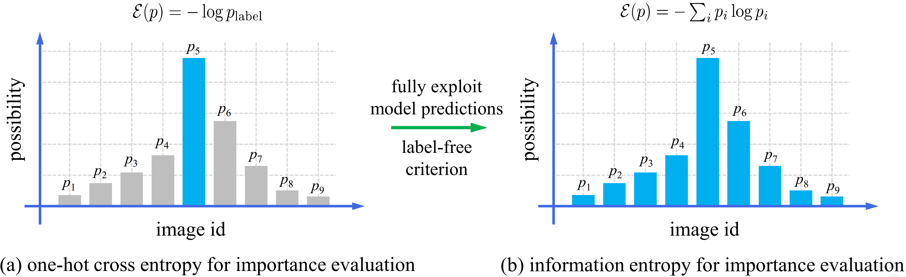
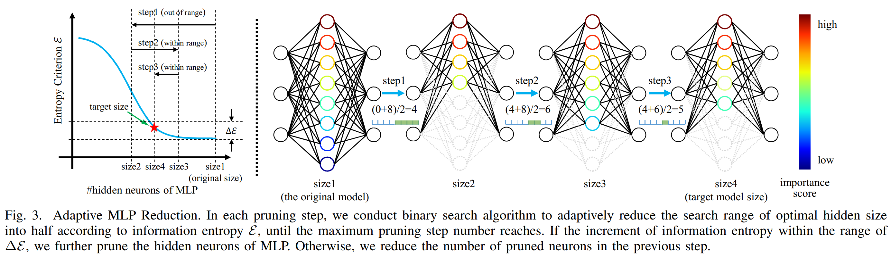
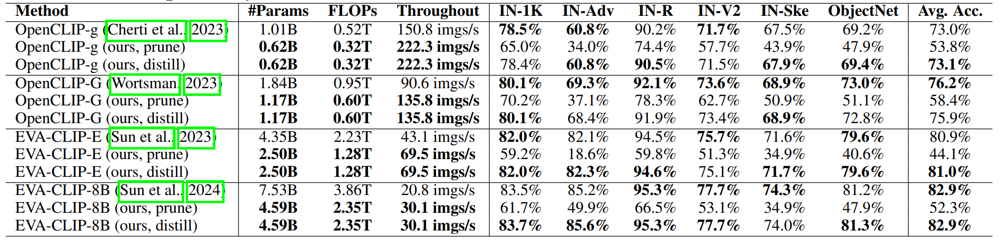

# Adaptive MLP Pruning for Large Vision Transformers

This repository is the official implementation of "Adaptive MLP Pruning for Large Vision Transformers".

[[Paper](https://arxiv.org/abs/2603.08100)]    [[BibTex](#Citation)]   [[HuggingFace](https://huggingface.co/visresearch/AMR/tree/main)]

In this paper, we propose an Adaptive MLP Pruning (AMP) method to substantially reduce the parameters of large vision transformers without obvious performance degradation. First, we adopt Taylor based method to evaluate neuron importance of MLP. However, the importance computation using **one-hot cross entropy loss ignores the potential predictions on other categories**, thus degrading the quality of the evaluated importance scores. To address this issue, we introduce label-free information entropy criterion to **fully model the predictions of the original model for more accurate importance evaluation**. Second, we rank the hidden neurons of MLP by the above importance scores and apply binary search algorithm to adaptively prune the ranked neurons according to the redundancy of different MLP modules, thereby avoiding the predefined compression ratio.

Experimental results on several state-of-the-art large vision transformers, including CLIP and DINOv2, demonstrate that our method achieves **roughly 40% parameter and FLOPs reduction in a near lossless manner**. 





### 1. Installation

```bash
conda create -n AMP python=3.9
conda activate amp
pip install -r requirements.txt
```


### 2. Configuration

For convenience,  we organize the hyper-parameters in `*.yaml` files at path `./configs`.  To run the code, please edit these parameters according to your environment. 

For the distillation of pruned Open CLIP models, you are required to set `teacher.pretrained`, `student.pretrained`, `data.root` at configuration file `configs/distill/distill_open_clip_g.yaml` (or other config files in `configs/distill`).


### 3. MLP Reduction

The reduction process consists of two steps: Importance Scoring and Pruning.

**Step 1: Calculate Importance Scores**

```bash
python main_score.py \
    --config_file configs/prune_entropy/open_clip_g_coco_entropy.yaml \
    --frame open_clip
```

**Step 2: Prune Model**

```bash
python main_prune.py \
      --config_file configs/prune_entropy/open_clip_g_coco_entropy.yaml
```


### 4. Distillation

```bash
NGPU=$(nvidia-smi --query-gpu=name --format=csv,noheader | wc -l)
torchrun \
    --nproc_per_node=$NGPU \
    --master-port=29511 distill.py \
    --config_file configs/distill/distill_open_clip_g.yaml \
    --frame open_clip
```


### 5. Evaluation

+ **Zero-Shot Classification On ImageNet1K**

```bash
NGPU=$(nvidia-smi --query-gpu=name --format=csv,noheader | wc -l)

torchrun --nnodes=1 --nproc_per_node=$NGPU --master-port=29502 \
	eval/eval_zsc.py \
    --model $model \
    --pretrained $ckptpath \
    --batch_size $batch_size \
    --save_clf /path/to/clf \
    --dataset imagenet1k \
    --dataset_root  /path/to/ILSVRC2012 \
    --task zeroshot_classification
```

**Tips**: At the first evaluation, you are required to pass the `save_clf` parameter, so the text encoding for zero-shot classification will be saved.  For latter evaluation, you can set the `load_clfs` parameter as the previous `save_clf` to skip the running of text encoder.


+ **Zero-Shot Retrieval On COCO**

```bash
torchrun --nnodes=1 --nproc_per_node=$NGPU --master-port=29502 \
	eval/eval_zsc.py \
  --model $model \
  --model_type $model_type \
  --pretrained $ckptpath \
  --language "en" \
  --task "zeroshot_retrieval" \
  --dataset "mscoco_captions" \
  --dataset_root $coco_dataset_path \
  --batch_size $batch_size \
  --dataset_root $coco_dataset_path
```


+ **Zero-Shot Retrieval On Flickr30k**

```bash
torchrun --nnodes=1 --nproc_per_node=$NGPU --master-port=29502 \
	eval/eval_zsc.py \
  --model $model \
  --model_type $model_type \
  --pretrained $ckpt_path \
  --language "en" \
  --task "zeroshot_retrieval" \
  --dataset "flickr30k" \
  --dataset_root $flickr30k_dataset_path \
  --batch_size $batch_size 
```


### 6. Main Results



The performance comparison on zero-shot image classification tasks of various ImageNet variants and ObjectNet. “#Params” denotes the number of vision encoder’s parameters, excluding the parameters of text encoder. Throughout is averaged over 10 runs on single A6000 GPU with batch size of 1000. “prune” and “distill” indicate the pruned model without finetuning and the distilled one, respectively.  


### Citation

```bibtex
@article{shen2026adaptive,
  title={Adaptive MLP Pruning for Large Vision Transformers},
  author={Shen, Chengchao},
  journal={arXiv preprint arXiv:2603.08100},
  year={2026}
}
```


### License

This project is under the CC-BY-NC 4.0 license. See [LICENSE](LICENSE) for details.

